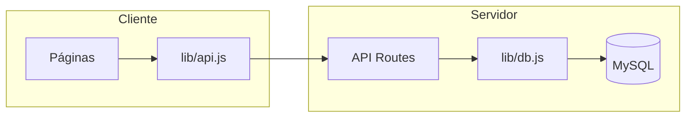

# Análise profunda do ERP — base para o módulo Condomínio

Documento de análise do sistema antes da implementação do módulo de gestão de condomínio. Objetivo: mapear arquitetura, dados, relacionamentos e pontos de integração.

---

## 1. Arquitetura do projeto

### 1.1 Stack e estrutura de pastas

| Camada | Tecnologia | Uso |
|--------|------------|-----|
| Framework | Next.js 14 (App Router) | Rotas, SSR/CSR, API routes |
| UI | React 18, Radix UI, Tailwind CSS, CVA, clsx | Componentes, temas, acessibilidade |
| Ícones | lucide-react | Sidebar, cards, formulários |
| Gráficos | Recharts | Relatórios, dashboard, inadimplentes |
| Banco | MySQL (mysql2/promise) | Persistência via `lib/db.js` |
| Datas | date-fns | Filtros, vencimentos, agrupamentos |

Estrutura de diretórios relevante:

```
kitnets/
├── app/
│   ├── layout.js              # Root: HTML, globals.css, tema
│   ├── page.js                # Redirect / → /dashboard
│   ├── (app)/                 # Grupo de rotas (sem segmento na URL)
│   │   ├── layout.js          # DashboardLayout (sidebar + header)
│   │   ├── dashboard/
│   │   ├── inquilinos/
│   │   ├── pagamentos/
│   │   ├── inadimplentes/
│   │   ├── obras/ + obras/[id]/...
│   │   ├── manutencao/
│   │   ├── despesas/
│   │   └── relatorios/
│   └── api/                   # API routes (GET/POST/PUT/DELETE)
│       ├── tenants/
│       ├── payments/ (+ generate)
│       ├── expenses/
│       ├── maintenance/
│       └── obras/ + obras/[id]/costs|materials|workers|stages|agenda
├── components/
│   ├── layout/                # dashboard-layout, sidebar, header
│   ├── ui/                    # shadcn-style: Button, Card, Input, Select, Table...
│   ├── forms/                 # payment-form, tenant-form...
│   ├── dashboard/             # DashboardStatCard, charts do dashboard
│   ├── reports/               # Relatórios (RevenueVsExpensesChart, etc.)
│   ├── payments-analytics/    # KPIs e gráficos da página Pagamentos
│   ├── inadimplencia/         # Stats, donut, timeline, TopDebtorsList
│   └── obra-reports/          # Gráficos e listas de obras
├── lib/
│   ├── db.js                  # Pool MySQL + mappers (rowToTenant, rowToPayment...)
│   ├── api.js                 # Cliente: fetchTenants, fetchPayments, fetchExpenses...
│   ├── calculations.js        # getExpected, getPaymentStatus, getDashboardNumbers...
│   ├── payments-generation.js # Geração de parcelas por inquilino
│   ├── generateId.js          # IDs para inserts
│   └── utils.js               # cn, etc.
├── context/                   # page-header (obra layout)
└── scripts/migrations/       # SQL de migração (ex.: add-expected-amount.sql)
```

### 1.2 Fluxo de dados (resumo)



- **Cliente:** páginas chamam `lib/api.js` (fetch para `/api/...`).
- **Servidor:** rotas em `app/api/*` usam `pool` e mappers de `lib/db.js`; não há uso de `lib/storage.js` (localStorage) para persistência.
- **Cálculos:** feitos no cliente com dados já carregados (ex.: `lib/calculations.js` em Relatórios e Inadimplentes).

---

## 2. Estrutura do banco de dados

Banco: **MySQL** (`MYSQL_DATABASE` = `kitnet_manager`). Inferência a partir de `lib/db.js` e das API routes.

### 2.1 Tabelas existentes (inferidas)

| Tabela | Uso principal | Observação |
|--------|----------------|------------|
| **tenants** | Inquilinos | `id`, `name`, `phone`, `kitnet_number`, `rent_value`, `start_date`, `status`, `observacao`, `created_at`, `updated_at` |
| **payments** | Pagamentos (aluguel) | `id`, `tenant_id`, `month`, `year`, `due_date`, `payment_date`, `amount`, `expected_amount`, `status`, `created_at`, `updated_at` |
| **expenses** | Despesas gerais | `id`, `type`, `value`, `date`, `description`, `created_at`, `updated_at` |
| **maintenance** | Manutenção | `id`, `type`, `location`, `description`, `priority`, `status`, `created_at`, `updated_at` |
| **obras** | Obras (projetos) | `id`, `name`, `budget`, `start_date`, `end_date`, `area_m2`, `status`, ... |
| **obra_costs** (ou similar) | Custos por obra | `id`, `obra_id`, `date`, `category`, `description`, `value`, ... |
| **obra_materials** | Materiais por obra | `id`, `obra_id`, `material_name`, `quantity`, `unit`, `unit_price`, ... |
| **obra_workers** | Trabalhadores por obra | `id`, `obra_id`, `name`, `role`, `daily_rate`, `days_worked`, `total_paid`, ... |
| **obra_stages** | Etapas por obra | `id`, `obra_id`, `name`, `status`, `start_date`, `due_date`, ... |
| **obra_agenda** | Agenda por obra | `id`, `obra_id`, `date`, `activity`, `responsible`, ... |
| **obra_stage_workers** (se existir) | Vínculo etapa–trabalhador | Mapper em `db.js`; rota `/api/obras/[id]/stage-workers` não encontrada no código |

Não existe tabela **kitnets**: “kitnet” no sistema é o campo `tenants.kitnet_number` (número da unidade).

### 2.2 Migrações conhecidas

- `add-expected-amount.sql`: adiciona `expected_amount` em `payments` (valor devido do mês); `amount` continua sendo o valor pago.

---

## 3. Relacionamentos: tenants, pagamentos, kitnets, relatórios

### 3.1 Diagrama de entidades (conceitual)

```mermaid
erDiagram
  tenants ||--o{ payments : "tem"
  tenants {
    string id PK
    string name
    string kitnet_number
    decimal rent_value
    date start_date
    string status
  }
  payments {
    string id PK
    string tenant_id FK
    int month
    int year
    date due_date
    date payment_date
    decimal amount
    decimal expected_amount
    string status
  }
  expenses {
    string id PK
    string type
    decimal value
    date date
  }
  obras ||--o{ obra_costs : "tem"
  obras ||--o{ obra_stages : "tem"
  tenants .. "kitnet_number" : "unidade"
```

- **Inquilino (tenant):** uma unidade lógica (nome, telefone, número da kitnet, valor do aluguel, data de início, status). Não há entidade “Kitnet” separada; a lista de kitnets na UI é derivada de `tenants[].kitnetNumber`.
- **Pagamento (payment):** sempre ligado a um `tenant_id`; representa uma parcela mensal (month/year) com valor devido (`expected_amount`) e valor pago (`amount`). Status: pendente / pago / atrasado (calculado).
- **Despesas (expenses):** genéricas (tipo, valor, data); usadas em Relatórios e Dashboard para lucro (receita − despesas). Não estão ligadas a inquilinos nem a condomínio hoje.
- **Obras:** entidade separada (projetos de construção/reforma), com custos, materiais, trabalhadores, etapas, agenda. Não há vínculo direto com pagamentos ou condomínio no código atual.

### 3.2 Onde cada entidade é usada

| Entidade | Páginas / API | Uso |
|----------|----------------|-----|
| Tenants | Inquilinos, Pagamentos, Inadimplentes, Relatórios, Dashboard | CRUD; valor devido = `rentValue`; filtros por inquilino/kitnet |
| Payments | Pagamentos, Inadimplentes, Relatórios, Dashboard | Listagem, status, totais, receita prevista/recebida, inadimplência |
| Kitnets | Pagamentos, filtros | Lista = `[...new Set(tenants.map(t => t.kitnetNumber))]` |
| Expenses | Despesas, Relatórios, Dashboard | Lucro do mês/ano; gráficos receita vs despesas |
| Obras | Obras, Dashboard | KPIs, custos por categoria/mês, alertas |

---

## 4. Uso do valor de aluguel (rent_value)

### 4.1 Onde está armazenado

- **Fonte principal:** `tenants.rent_value` (DB) → `tenant.rentValue` (JS).
- **Cópia por parcela:** `payments.expected_amount` (valor devido daquele mês), preenchida na criação/geração do pagamento e opcionalmente na exibição.

### 4.2 Onde é usado na aplicação

| Local | Uso |
|-------|-----|
| **Pagamentos (page.js)** | `getValorDevido(p) = byTenant[p.tenantId]?.rentValue ?? p.expectedAmount ?? p.amount`. Colunas Valor devido, Pendente, Status; analytics e linha expandida usam o mesmo critério. |
| **PaymentForm** | “Valor devido” read-only vindo do inquilino; no submit envia `expectedAmount` (tenant.rentValue ou valor do form). |
| **API POST /api/payments** | Se `expectedAmount` não vier no body, busca `rent_value` do tenant e usa como expected. |
| **API POST /api/payments/generate** | Recebe `rentValue` no body e cria parcelas com `expected_amount = rentValue`. |
| **API GET /api/payments** | Para normalizar exibição (valor pago = valor devido), usa `byTenant[id].rentValue` ou `expectedAmount`. |
| **Inadimplentes** | `getPaymentRowData(payment, tenant?.rentValue)` para valor devido e status. |
| **Inquilinos** | Ao criar inquilino, pode chamar `generatePaymentsForTenant(id, rentValue, startDate)`. |
| **lib/calculations.js** | `getExpected(payment)` usa só `expectedAmount`/`amount` (sem tenant); `getPaymentRowData(payment, rentValueFromTenant)` usa `rentValueFromTenant` quando informado. |

Conclusão: o **valor mensal devido** hoje é essencialmente **só o aluguel** (`rent_value` do inquilino), eventualmente fixado por parcela em `expected_amount`. Não existe ainda conceito de “condomínio” ou “aluguel + condomínio” no modelo de dados nem nas telas.

---

## 5. Como dashboards e relatórios usam os dados

### 5.1 Relatórios (`/relatorios`)

- **Dados:** `fetchTenants()`, `fetchPayments()`, `fetchExpenses()`.
- **Filtro:** mês/ano atual (`getCurrentMonthYear()`); sem seletor de período na UI.
- **Cálculos:** `getDashboardNumbers(tenants, payments, expenses)` em `lib/calculations.js`:
  - Receita esperada: soma de `getExpected(p)` dos pagamentos do mês.
  - Receita recebida: soma de `amount` dos pagamentos do mês com `paymentDate`.
  - Pendente / atrasado: `getTotalPending`, status atrasado/pendente.
  - Despesas do mês: `getExpensesForMonth`.
  - Lucro: recebido − despesas; tendências vs mês anterior.
- **Componentes:** Cards (StatsCard, FinanceMetricCard), Recharts (RevenueVsExpensesChart, PaymentDistributionChart), FinanceSummary.

### 5.2 Dashboard principal (`/dashboard`)

- **Dados:** `fetchTenants`, `fetchPayments`, `fetchExpenses`, `fetchObras`; por obra: `fetchObraCosts`, `fetchObraStages`.
- **Filtro:** ano atual; sem seletor na UI.
- **Cálculos:** `getDashboardNumbersYear(tenants, payments, expenses, year)`; KPIs de obras (custos, progresso); `buildYearlyChartData(payments, expenses, year)` (receita e despesas por mês); atividades recentes (pagamentos, despesas, custos); alertas (obras acima do orçamento, etapas atrasadas).
- **Componentes:** DashboardStatCard, BarChart (receita/despesas), CostDistributionChart, ExpenseTimelineChart, ProjectProgressList, RecentActivityFeed, SystemAlertsPanel.

### 5.3 Dashboard de obra (`/obras/[id]/dashboard`)

- **Dados:** `fetchObra`, `fetchObraCosts`, `fetchObraMaterials`, `fetchObraWorkers`.
- **Cálculos:** totais por categoria, por mês, por trabalhador; custo/m²; progresso.
- **Componentes:** ObraStatsCard, ObraCostsByCategoryChart, ObraCostsEvolutionChart, ObraFinancialProgress, ObraCostsAccordion, etc.

### 5.4 Inadimplentes (bloco analítico na página)

- **Dados:** `fetchPayments()`, `fetchTenants()`.
- **Filtro:** apenas pagamentos em aberto (pendente/atrasado); agrupamento por inquilino.
- **Cálculos (useMemo):** totais de inadimplentes, valor total em débito, atrasado vs pendente; dados para donut (status); timeline por período; top 5 por valor e por número de parcelas. Tudo com `getPaymentRowData(payment, tenant?.rentValue)`.
- **Componentes:** InadimplenciaStats, InadimplenciaStatusChart, InadimplenciaTimeline, TopDebtorsList, tabela agrupada por inquilino.

### 5.5 Página Pagamentos (analytics)

- **Dados:** `fetchPayments()`, `fetchTenants()`.
- **Cálculos:** `analyticsData` (totais, receita prevista/recebida, pendente, atrasado, taxa de adimplência, top 5 maiores débitos); `getValorDevido` sempre com `tenant.rentValue ?? expectedAmount ?? amount`.
- **Componentes:** PaymentsAnalyticsStats, PaymentsStatusDistribution (donut), PaymentsRevenueTimeline, PaymentsRevenueProgress, PaymentsTopDebts, tabela de listagem com expansão por inquilino.

Resumo: todos os números financeiros “do inquilino” (valor devido, receita, inadimplência) vêm de **payments + tenants**, com valor devido = **aluguel** (`rentValue` / `expectedAmount`). Despesas entram só no lucro geral (relatórios/dashboard), não por inquilino.

---

## 6. Navegação e onde encaixar Condomínio

Sidebar (`components/layout/sidebar.jsx`): array `items` com links para Dashboard, Inquilinos, Pagamentos, Inadimplentes, Obras, Manutenção, Despesas, Relatórios. Não há submenu; cada item é uma rota plana.

Para o módulo **Condomínio** o natural é:

- Nova rota: `/condominio` (ex.: `app/(app)/condominio/page.js` ou subrotas sob `app/(app)/condominio/`).
- Novo item no `items` do sidebar: `{ href: "/condominio", label: "Condomínio", icon: ... }`.

---

## 7. Pontos de integração para o módulo Condomínio

### 7.1 Banco de dados

- **Novas tabelas (conforme especificação):**
  - `condominium_base_values` — valor base e vigência (ex.: valor, data início).
  - `condominium_expenses` — despesas extras (nome, valor total, data, forma de rateio, parcelas).
  - `condominium_expense_splits` — rateio por unidade/período (se for por parcela/unidade).
  - `condominium_history` — histórico de cobranças (mês/ano, valor base, extras, total).

- **Payments / Tenants:** hoje um pagamento tem um único “valor devido” (`expected_amount`). Para integrar condomínio há duas abordagens possíveis:
  1. **Valor único:** o “valor devido” do pagamento passa a ser **aluguel + condomínio** (calculado por mês a partir do módulo condomínio). Nesse caso, `expected_amount` continua sendo o total cobrado; a origem (aluguel vs condomínio) pode ser apenas exibida (composição) ou persistida em coluna auxiliar.
  2. **Cobrança separada:** manter `expected_amount` só para aluguel e ter outra entidade/tabela para “pagamentos de condomínio” (ex.: `condominium_charges` por tenant/month/year). Relatórios e dashboard precisariam somar as duas fontes quando “valor total” for exibido.

A escolha impacta: geração de parcelas (`/api/payments/generate`), formulário de pagamento, relatórios, inadimplentes e dashboard.

### 7.2 Cálculo do “valor devido” mensal

- Hoje: `valorDevido = tenant.rentValue ?? payment.expectedAmount ?? payment.amount`.
- Com condomínio (valor único na mesma parcela):  
  `valorDevido = (tenant.rentValue + condominioTotalNoMes(month, year))`  
  onde `condominioTotalNoMes` considera valor base vigente + parcelas de rateios ativas naquele mês.
- Funções em `lib/calculations.js` (ex.: `getPaymentRowData`, `getExpected`) ou nas páginas que calculam valor devido precisarão receber esse “valor devido total” ou buscar condomínio (API ou contexto).

### 7.3 APIs e lib/api.js

- Novos endpoints sugeridos:  
  `GET/POST /api/condominium/base-values`,  
  `GET/POST/PUT/DELETE /api/condominium/expenses`,  
  `GET /api/condominium/composition?month=&year=`,  
  `GET /api/condominium/history`,  
  etc.
- Em `lib/api.js`: funções correspondentes (`fetchCondominiumBaseValues`, `fetchCondominiumExpenses`, ...) para as páginas do módulo e para quem for calcular valor mensal (ex.: Pagamentos, Relatórios).

### 7.4 Páginas que devem “enxergar” condomínio

- **Pagamentos:** exibir composição (aluguel + condomínio) e usar valor total no devido quando a configuração for “cobrança junto”.
- **Inadimplentes:** mesmo critério de valor devido (total incluindo condomínio, se aplicável).
- **Relatórios:** receita esperada/recebida pode incluir condomínio ou ter linha separada, conforme regra de negócio.
- **Dashboard:** possivelmente um card ou seção “Condomínio” (arrecadação, valor médio).

### 7.5 Configuração “junto vs separado”

- Especificação: “O valor do condomínio deve poder aparecer junto com o aluguel ou ser cobrado separadamente.”
- Implementação típica: uma configuração global (ex.: tabela `settings` ou flag em front/backend) definindo modo “integrado” (uma parcela = aluguel + condomínio) ou “separado” (duas linhas ou duas entidades de cobrança). Essa escolha define onde o valor de condomínio entra no `expected_amount` e nas telas.

---

## 8. Resumo executivo

| Tema | Conclusão |
|------|-----------|
| **Arquitetura** | Next.js 14 App Router, MySQL, lib/db + lib/api + lib/calculations; componentes modulares por área (dashboard, reports, payments-analytics, inadimplencia, obra-reports). |
| **Banco** | Tabelas: tenants, payments, expenses, maintenance, obras e relacionadas. Sem tabela kitnets; sem tabelas de condomínio. |
| **Relacionamentos** | Tenant → muitos Payments. “Kitnet” = tenant.kitnetNumber. Expenses independentes. Obras com custos/materiais/trabalhadores/etapas. |
| **Aluguel** | Fonte: `tenants.rent_value`; cópia em `payments.expected_amount`. Usado em Pagamentos, Inadimplentes, geração de parcelas, Relatórios e Dashboard como “valor devido” do mês. |
| **Dashboards/Relatórios** | Consomem tenants + payments (+ expenses para lucro). Valor devido e status sempre baseados em aluguel (e expected_amount). Recharts já usado; padrão de cards e tabelas estabelecido. |
| **Integração Condomínio** | Exigirá: novas tabelas; novas API e funções em lib/api; regra de “valor devido” (aluguel + condomínio) em calculations e nas páginas de Pagamentos/Inadimplentes/Relatórios; opção “junto vs separado”; item “Condomínio” na sidebar. |

Este documento serve de base para desenhar o módulo de gestão de condomínio (dashboard, valor base, rateio, composição, histórico e integração com pagamentos) com consistência com o resto do ERP e nível de produto SaaS desejado.
